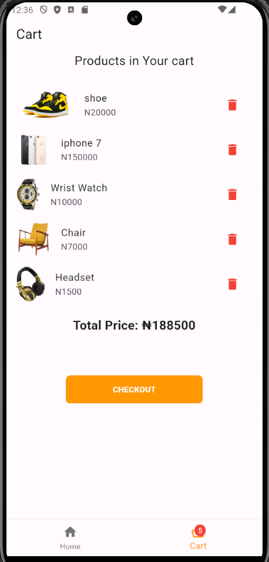
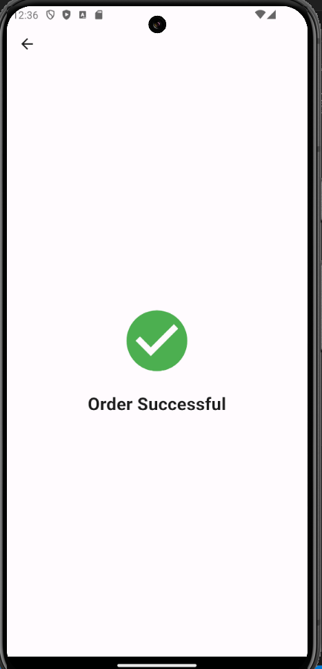

# shoppingapp

A simple shopping app built with Flutter.

## Description

ShoppingApp is a simple mobile application that allows users to browse through products, add them to a cart, and proceed to checkout. The app demonstrates basic Flutter concepts such as navigation, state management, and custom widgets.

- **Usage:** 
1. Home Screen: Browse through the list of products.
2. Cart: Add products to your cart and view them in the cart page.
3. Checkout: Proceed to checkout and see a success message.

## Features
- Product listing
- cart listing
- Add products to cart
- Remove products from cart
- View total price of products in cart
- Checkout process

## Installation

Follow these steps to set up the project locally:

1. **Clone the repository:**
   ```sh
   git clone https://github.com/Omozuas/shopping_app.git
   cd shoppingapp
2. **Install Flutter dependencies**
   flutter pub get
3. **Run the app**
   flutter run


## Screenshots

1. **Product Page**


2. **Cart Page**


3. **Checkout Page**


- **APK Download:** Provide a link to download the APK.
- **Contact Information:** 
- **Name**:`Omozua Judah ` 
- **Email**:`iyanuomozua.email@example.` 
- **GitHub**:(https://github.com/Omozuas)

